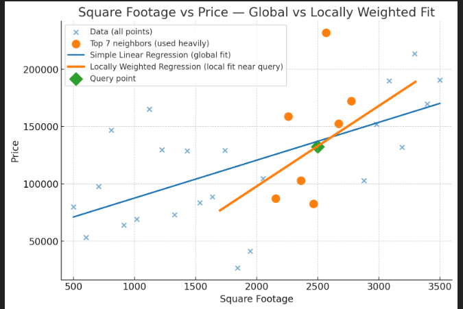

# Parametric vs Non-Parametric Learning Algorithms

## Parametric Algorithms

- Assume a **fixed model or curve shape** (e.g., straight line, polynomial) that fits the **entire dataset**.
- Find the best parameters (numbers) for this model using all the data.
- Once learned, this **single formula** is used to predict any new point.
- The model **summarizes all data into a few parameters** and uses them for prediction.

## Non-Parametric Algorithms

- Do **not assume a single fixed model for all data**.
- Look at **local groups of data points near the point to predict** (like clustering or weighting neighbors).
- Fit a **simple model only for that local neighborhood** to make predictions.
- The entire dataset is used at prediction time to find relevant neighbors or clusters.
- Instead of one global formula, use many **local formulas** that adapt depending on where you want to predict.

## Summary Table

| Aspect                   | Parametric                                 | Non-Parametric                              |
|--------------------------|--------------------------------------------|---------------------------------------------|
| Model                    | One fixed model for whole data             | Many local models for each prediction       |
| Use of dataset           | All data used to find fixed parameters     | All data used at prediction time for neighbors |
| Prediction formula       | One global formula                          | Local formulas fitted on small neighborhoods |
| Data summary             | Summarized into fixed number of parameters | Uses data directly without compression       |

